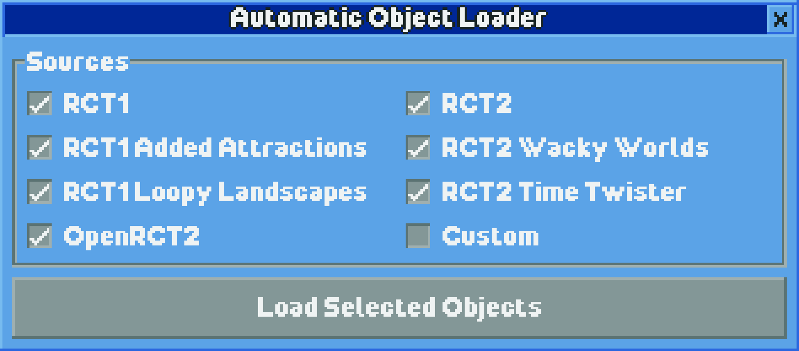
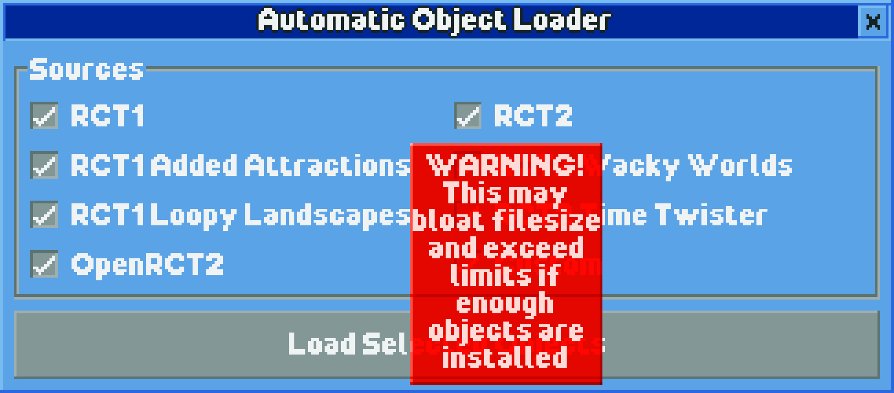
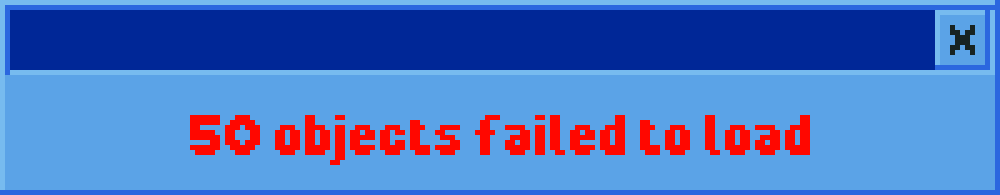
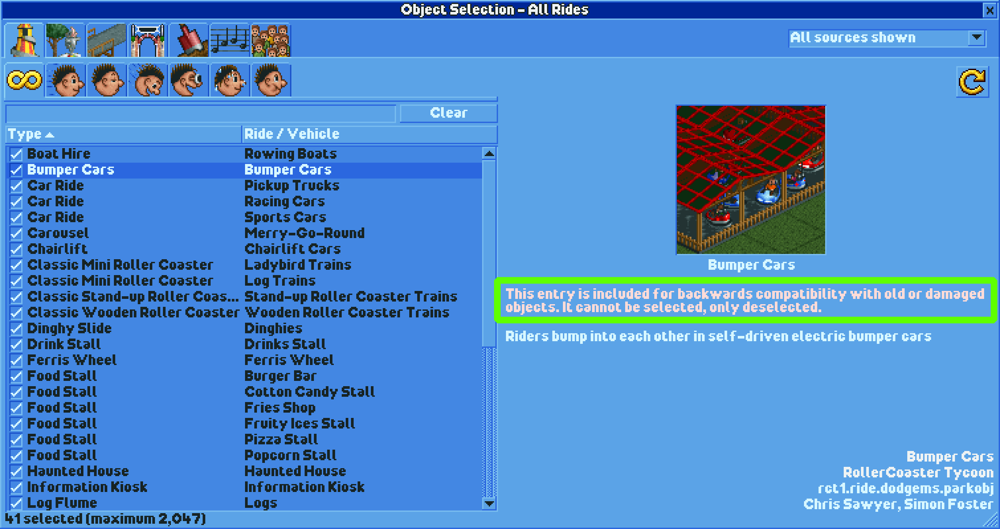

# Automatic Object Loader

Ever wanted an easy way to select every object so you can build your dream sandbox park? Look no further than this plugin! With the simple click of a button, every object that matches any source you select will load in.

The load time will vary depending on how many objects match the filter. Once loading begins, you will see this window pop-up:

After all these objects are successfully loaded, the text will update to the following:

## Getting the plugin

Download the `.js` file from the [latest release](https://github.com/KatieZeldaKat/openrct2-auto-object-loader/releases/latest) and place it in the "plugin" folder. This can be found by opening OpenRCT2 and selecting "Open custom content folder" under the toolbox in the main menu.

---

## Custom Content

OpenRCT2's object limits are high enough that selecting all built-in objects will not reach this ceiling. However, custom objects can, which would produce an error such as this:

Be wary of this when selecting "Custom" as a source. If you have a lot of custom objects, consider selecting the other sources you desire, then manually loading your preferred custom objects through the Object Selection window.

## Compatibility Objects

These are objects which can be deselected from the Object Selection window, but not selected again afterwards. Plugins can technically load these objects into the game. However, this plugin purposefully leaves them out given these are meant for backwards-compatibility and not for use in new parks.
